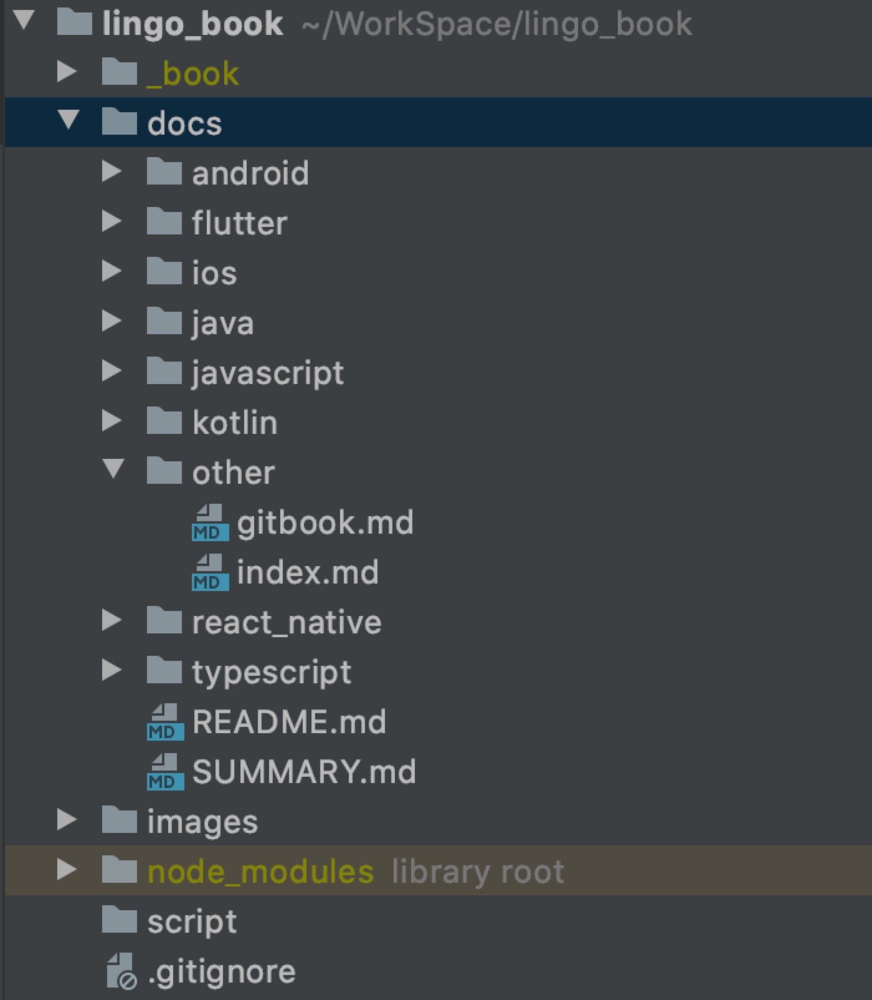

# GitBook 安装及使用

GitBook 可以帮助你写 API 文档或者写自己的博客，使用 markdown 写文章，使用 github 托管文件，也可以使用 github 做图床。

## 安装

```bash
sudo npm install gitbook-cli -g
```


安装完成后，新建一个项目文件夹 MyGitBook, 使用命令初始化 GitBook。

```text
gitbook init
```

初始化后会生成两个必要的文件 `README.md` 和 `SUMMARY.md`

* README.md: 书的介绍、简介。在章节中，也可以作为章节的简介。
* SUMMARY.md: 书的章节结构和顺序。

添加文件夹作为文章的章节




## 本地预览

```text
gitbook serve
```

浏览器打开 `http://localhost:4000` 浏览

## 安装插件

[博文](https://www.jianshu.com/p/427b8bb066e6)

